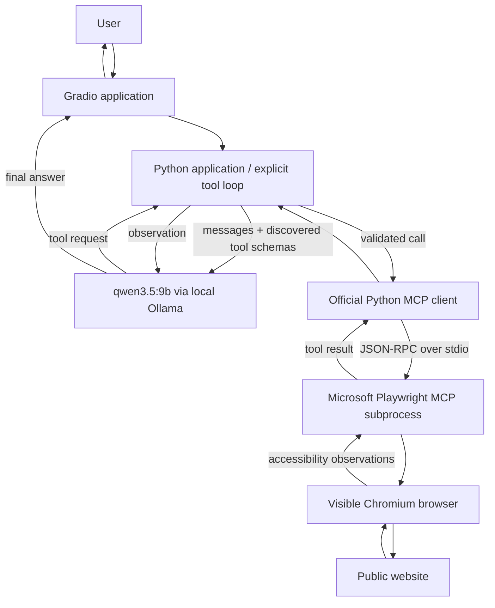

# Local Web Research Assistant — Ollama + Playwright MCP

A university teaching project that lets **qwen3.5:9b running locally in Ollama** research a
public website through Microsoft's **external Playwright MCP server**. Gradio shows the answer,
the actual discovered capabilities, observable tool activity, and visited pages. Chromium is
**visible by default**, so a class can watch the model navigate.

No cloud LLM API, API keys, agent framework, or direct Python Playwright calls are used.

## What this project demonstrates

The progression from an introductory course-information example is:

**Native function → custom MCP server → real third-party MCP server → real external capability.**

Microsoft provides the Playwright MCP server. This repository provides the MCP **client** and
the application loop that connects it to a local model. The model selects an action; Python
validates and routes it; the external server controls the browser.

## Architecture



Keep these five roles separate when explaining the code:

| Role | Responsibility | Read the code |
|---|---|---|
| LLM | Chooses tools and writes an answer | `app/ollama_client.py` |
| Application/tool loop | Maintains messages, validates calls, applies limits, records activity | `app/agent.py` |
| MCP client | Starts stdio transport, discovers and invokes tools | `app/mcp/playwright_client.py` |
| External MCP server | Implements the generic browser capabilities | `@playwright/mcp@0.0.83` |
| Controlled system | Loads pages and exposes accessibility state | Real Chromium |

## Why MCP?

There is no custom HAMK browser API and no predefined route through the site. The client asks
the server what tools it has, then gives the enabled definitions to the model. The same tools
work for a university, Python documentation, GitHub documentation, and other public websites.
The default HAMK URL and question live only in the interface and optional smoke-test scenario.
Programme facts are never supplied in runtime prompts or helper functions.

## Requirements and verified versions

- Python **3.12+** (developed and tested on 3.13 / Windows 11).
- [uv](https://docs.astral.sh/uv/getting-started/installation/).
- [Node.js](https://nodejs.org/en/download) LTS with npm/npx (Node 24 used locally).
- [Ollama](https://ollama.com/download/windows), running locally.
- The local **`qwen3.5:9b`** model and enough memory for it and the context window.
- Internet access for dependency/browser installation and live website research.

Python pins: `mcp==2.1.1`, `ollama==0.6.2`, `pydantic==2.13.5`, `gradio==6.26.0`.
All resolved Python versions, including pytest and Ruff, are in `uv.lock`.
The official npm registry reported **`@playwright/mcp@0.0.83`** on 4 October 2026; this is
pinned in configuration. Its bundled Playwright version supplies the matching Chromium build.

Sources: [official Microsoft server and configuration](https://github.com/microsoft/playwright-mcp/tree/v0.0.83),
[official MCP Python 2.1.1 client documentation](https://github.com/modelcontextprotocol/python-sdk/blob/v2.1.1/docs/client/index.md),
[official Ollama Python client](https://github.com/ollama/ollama-python).

## Setup — Windows PowerShell

If the prerequisites are missing, install Python 3.13, Node.js LTS, uv, and Ollama from their
official installers, then reopen PowerShell. For example, with Windows Package Manager:

```powershell
winget install --id Python.Python.3.13 -e
winget install --id OpenJS.NodeJS.LTS -e
winget install --id astral-sh.uv -e
winget install --id Ollama.Ollama -e
```

Clone the repository (or open PowerShell in your existing checkout):

```powershell
git clone https://github.com/mazarbaloch/mcp-ai.git
cd mcp-ai
uv sync --frozen
ollama pull qwen3.5:9b
npx --yes --package=@playwright/mcp@0.0.83 playwright install chromium
uv run python -m scripts.check_environment
```

The browser installation is a one-time step per Playwright version. It may print a generic
warning about not having npm project dependencies; the explicit `--package` selects this
project's exact MCP/Playwright version. No `npm install` in this repository is necessary.
On Linux, browser system libraries may also be needed; use the same command with
`playwright install --with-deps chromium`.

Start the Ollama desktop application. If it is not already serving, run the following in a
**separate terminal** and leave it running:

```powershell
ollama serve
```

If the port is already in use and `ollama list` works, Ollama is already running.
No `.env` file or API key is required.

## Running

```powershell
uv sync
uv run python -m app.main
```

Open [the local Gradio UI](http://127.0.0.1:7860). It checks Ollama and discovers the real MCP
tools on load; **Check connections** repeats discovery. Clicking **Research** opens a fresh MCP
session and isolated Chromium. The browser opens when the model first navigates and closes
when research finishes. Status, calls, previews, and visited pages stream into the UI as work
progresses. The server listens only on loopback and does not create a public Gradio share.

One research run executes at a time. Each run owns its browser and MCP session; nothing is
shared with a personal Chrome profile. Stop the app with **Ctrl+C** in its terminal.

## Lecture demonstration

1. Start Ollama.
2. Start the application.
3. Confirm Playwright MCP tools appear in **MCP Capabilities**.
4. Use starting URL `https://www.hamk.fi/en/`.
5. Ask: **"Find the Computer Applications bachelor's programme. Tell me its duration and number
   of credits, and find where I can see the current curriculum or module map."**
6. Watch the Chromium browser navigate.
7. Observe the **MCP Tool Activity** panel.
8. Inspect the final answer and visited pages. Compare claims with the browser observations.
9. Change the starting URL and demonstrate that the same MCP tools work on a different website.

The local model can take time between calls, particularly on CPU or during first load. This is
a live research demonstration: website changes and model decisions can lead to an incomplete
run. The step limit and errors are visible teaching examples, not hidden retries or canned answers.

## Example prompts

| Starting URL | Research task |
|---|---|
| `https://docs.python.org/3/` | Find the tutorial section about lists and explain two operations it documents. Cite the page. |
| `https://docs.github.com/en` | Find documentation about creating a repository from a template. Summarize the steps and cite the source. |
| `https://www.hamk.fi/en/` | Find the Computer Applications programme and locate its curriculum information. |
| `https://www.rust-lang.org/` | Find where a beginner can read the official Rust book. |

## MCP tool discovery and policy

The SDK 2.1.1 code uses `async with Client(StdioServerParameters(...))`. It negotiates the
connection and manages the subprocess. `list_tools()` returns `.tools`; definitions use
`.name`, `.description`, and **`.input_schema`**. Pagination uses `.next_cursor`. Tool results
use `.content` and **`.is_error`**. These are the 2.x APIs, not copied 1.x camel-case examples.

`tool_adapter.py` copies each enabled tool into Ollama's
`{"type": "function", "function": {"name": ..., "description": ..., "parameters": ...}}`
format. Descriptions and JSON schemas come from the server and are preserved.

The exact allowlist is the intersection of discovered tools with:

| Enabled tool | Purpose |
|---|---|
| `browser_navigate` | Open a validated public HTTP/HTTPS URL |
| `browser_navigate_back` | Return to a previous page |
| `browser_snapshot` | Read the page accessibility tree; `target`/`depth` can focus it |
| `browser_find` | Search accessibility text, retaining context and element references |
| `browser_click` | Follow an observed element reference |
| `browser_hover` | Reveal navigation or other page details |

The verified server exposes 25 tools. The UI lists the other 19 as **discovered but not enabled**:
`browser_close`, `browser_resize`, `browser_console_messages`, `browser_handle_dialog`,
`browser_emulate_media`, `browser_evaluate`, `browser_file_upload`, `browser_drop`,
`browser_fill_form`, `browser_press_key`, `browser_type`, `browser_network_requests`,
`browser_network_request`, `browser_run_code_unsafe`, `browser_take_screenshot`, `browser_drag`,
`browser_select_option`, `browser_tabs`, and `browser_wait_for`.

This list documents one verified version; the interface always displays actual discovery.
The model cannot invoke disabled tools even if it invents a call to one.

## The explicit tool loop

Read `app/agent.py` alongside the tool activity panel:

1. Send the task, starting URL, system message, and discovered tool definitions to Ollama.
2. The model returns a final answer or one/more tool requests.
3. Check each tool against discovery and the allowlist; validate its arguments with JSON Schema.
4. Invoke `client.call_tool(...)` over MCP stdio.
5. Record name, arguments, source, success/error/blocked status, duration, and a result preview.
6. Append the assistant's calls and corresponding tool results to the conversation.
7. Give the observations to the model for its next decision.

Calls in a batch execute sequentially because browser actions change page state. Every
requested call, including a rejected one, consumes the **50-call default budget**. A final model
answer is still permitted after the last call, but further browser work is stopped. A connection
failure stops the run; a normal MCP tool error is returned to the model so it can correct it.
There are separate timeouts for Ollama and MCP. Cancellation exits the owned contexts.

### Snapshots, context, and grounding

In Playwright MCP 0.0.83, automatic snapshots after navigation/clicks can be **file links**.
The model must use `browser_snapshot` or `browser_find` to read content through MCP. The client
does not read those files. A snapshot reference such as `[ref=e42]` is passed as `target="e42"`.
There is no screenshot/vision browsing.

The default context is 32,768 tokens. Results larger than 14,000 characters are compacted at
complete line boundaries, prioritizing page metadata, task terms, headings, element references,
and adjacent links. Omission is explicit, and the model can request focused content. When the
history grows, older observations are shortened while keeping assistant/tool message pairing.
A conservative byte-based heuristic reserves output space; it is not an exact tokenizer.
Very large schemas/tasks cause a graceful context-budget stop.

Only URLs in returned **Page URL** metadata are added to Visited pages. Requested URLs,
unvisited links, and model-generated citations do not count as visits. A final answer requires
page metadata and an actual reference-bearing observation, not just a title or file link.
This is a grounding aid, not an automatic proof of every model claim. Inspect the sources.
Qwen's separate reasoning mode is disabled to keep lecture response times bounded. Any
`thinking` field returned by the model is discarded and never shown or saved. When the server
returns only a snapshot file link, the application adds a short reminder to request its content
through `browser_snapshot`; the model still chooses and issues the actual MCP call.

## Configuration

Environment variables are optional; change them in the terminal before launching:

| Variable | Default | Meaning |
|---|---|---|
| `OLLAMA_HOST` | `http://localhost:11434` | Local loopback Ollama only |
| `OLLAMA_MODEL` | `qwen3.5:9b` | Installed local tool-capable model; also editable in UI |
| `OLLAMA_NUM_CTX` | `32768` | Context tokens (8,192–131,072) |
| `PLAYWRIGHT_MCP_PACKAGE` | `@playwright/mcp@0.0.83` | Pinned official package |
| `PLAYWRIGHT_HEADLESS` | `false` | Keep false for a visible lecture browser |
| `MAX_TOOL_STEPS` | `50` | Maximum individual tool calls (1–50) |
| `MODEL_TIMEOUT` | `300` | Seconds per local model response |
| `TOOL_TIMEOUT` | `90` | MCP request timeout in seconds |
| `RESULT_MAX_CHARS` | `14000` | Maximum retained characters per observation |

```powershell
$env:OLLAMA_NUM_CTX = "32768"
$env:PLAYWRIGHT_HEADLESS = "false"
uv run python -m app.main
```

Ollama 0.6.2's Python response type predates cloud-model metadata. The app requires local
weight metadata from `show()` before inference and rejects models lacking it. Model calls
always go to a loopback Ollama server; no hosted model fallback is configured.

## Security boundaries and lifecycle

- Validate starting and model-requested navigation URLs. Reject file/data/javascript schemes,
  URL credentials, malformed hosts, localhost, and literal private/reserved IP addresses.
- Expose only the six research tools. Arbitrary evaluation/code, uploads, shell execution,
  typing/forms, screenshots, and network-request tools are not available to the model.
- Validate against the discovered schema, reject unknown arguments, and reject `filename`
  even when the server's original schema permits it.
- Use an isolated browser, an empty temporary MCP working directory, blocked service workers,
  and `acceptDownloads: false`. Never enable unrestricted file access or page-defined WebMCP tools.
- Keep browsing observations separate from instructions; the prompt says to ignore instructions
  inside websites and avoid sign-in, form submission, purchases, and downloads.
- Close the MCP SDK context after every run, including failures. SDK 2.1.1 closes stdin, waits,
  and escalates to process-tree termination if needed; it also manages a Windows process job.
  Temporary server outputs are removed, and Ollama HTTP clients are closed.

The allowlist is **not a network sandbox**: clicking links can change remote state, and hostname
checks do not prevent DNS rebinding or every redirect/subresource request to private networks.
Use public, unauthenticated sites on a teaching machine. Do not use the demo as an unattended
security boundary or expose its UI publicly. No credentials or browser profiles are needed.

## Testing

Deterministic tests use mocked Ollama and MCP responses. They require no Ollama server,
model, Chromium, GUI, or live website. After dependency installation:

```powershell
uv sync --frozen
uv run ruff check .
uv run ruff format --check .
uv run pytest -q
```

Tests cover URL and configuration validation, schema conversion, allowlists, malformed and
disabled calls, sequential and batched calls, tool errors/disconnects, no-evidence answers,
step limits, activity fields, context compaction, local model availability, and cleanup paths.
GitHub Actions runs these same checks on every push and pull request.

Run real integration checks explicitly (headless by default):

```powershell
# Real stdio server + discovery + browser navigation + snapshot; no model required
uv run python -m scripts.smoke_test mcp --report .artifacts/mcp.json

# Real qwen3.5:9b receives discovered schemas and requests browser tools
uv run python -m scripts.smoke_test ollama --report .artifacts/ollama.json

# Full live lecture scenario
uv run python -m scripts.smoke_test hamk --report .artifacts/hamk.json

# Optional: watch a real smoke test in visible Chromium
uv run python -m scripts.smoke_test mcp --headed
```

The scripts exit nonzero on failure. HAMK checks require multiple operations, a relevant observed
programme/curriculum URL, and a final answer. They deliberately do not assert hard-coded programme
facts. Read the answer and observations to evaluate grounding. Reports are optional, stay local,
and are ignored by Git. See [verification notes](docs/verification.md) for actual results and limits.

## Troubleshooting

| Symptom | Action |
|---|---|
| Ollama unavailable | Open Ollama or run `ollama serve`; check `ollama list`. |
| Model not installed | Run `ollama pull qwen3.5:9b`. |
| Node/npm/npx missing | Install Node.js LTS, reopen PowerShell, run `node --version` and `npx --version`. |
| Browser executable missing | Repeat the pinned Chromium installation command above. |
| MCP startup fails | Check the package version, npm access/proxy, and terminal stderr; use the MCP smoke test. |
| Slow model or timeout | Check available RAM/VRAM; close other model workloads, increase `MODEL_TIMEOUT`, or narrow the task. |
| Tool reference error | References change with navigation; the model should find/snapshot again and use the bare reference. |
| Site blocked, CAPTCHA, cookie overlay | Use another public starting page or retry later; the demo does not bypass access controls. |
| Step limit reached | Inspect activity and narrow the task; optionally increase `MAX_TOOL_STEPS`. |

## Project map

```text
app/
  main.py                 Gradio UI and one-task-per-session ownership
  agent.py                Explicit model/tool loop
  config.py               Environment settings and URL validation
  models.py               Observable run/activity data
  observations.py         Bounded observations and observed page URLs
  ollama_client.py        Local model availability and chat
  errors.py               Useful errors from nested async exceptions
  mcp/
    playwright_client.py  External server lifecycle and discovery (MCP 2.1)
    tool_adapter.py       MCP schema -> Ollama function schema
    tool_registry.py      Discovery, allowlist, argument validation
scripts/                  Environment check and opt-in real smoke tests
tests/                    Offline deterministic tests
.github/workflows/ci.yml   Ruff + pytest, no live services
```
